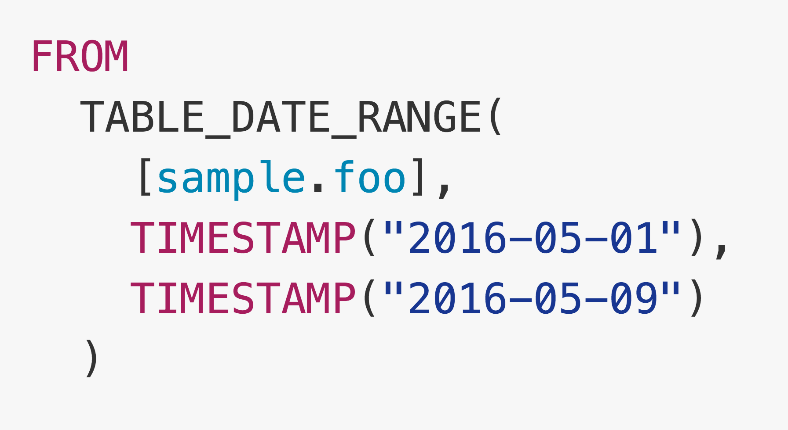

% Bigquery Standard SQL
% yamotonalds
% 2016-10-20

# 

## ２週間ほど前…

##


## 🐼「おっ」

## ちなみに

2016-06-02 

[Standard SQL Beta](https://cloud.google.com/blog/big-data/2016/06/bigquery-111-now-with-standard-sql-iam-and-partitioned-tables)

## 

>While we think the updated dialect is a wonderful addition, there's no requirement that users switch, and for production use cases, we recommend users remain on the legacy SQL dialect. After we have a few more miles on the new dialect, we plan to launch it to general availability and recommend it as the default language for all projects.

## 

2016-10-04

[Migrating from legacy SQL](https://cloud.google.com/bigquery/sql-reference/migrating-from-legacy-sql)

## 

>Migration from legacy SQL to standard SQL is recommended but not required.

. . . 

<span style="color: #666; font-style: italic">窓に！窓に！ </span>

## というわけで。

## Bigquery Standard SQL

について予習しておきましょう🐼


# Legacyからの変更点

## 注意

- [Migrating from legacy SQL](https://cloud.google.com/bigquery/sql-reference/migrating-from-legacy-sql)に書いてある内容からピックアップしただけ
- 数が多いので駆け足
- 気になるやつがあったらアピールしてね！

. . .

（止まるとは言ってない）

## SELECT中にSELECTが使えるようになった

##


## こういうのはダメ

## 


## WITHを使えばOK

## 


## 

- `CREATE TEMPORARY TABLE` みたいなやつ
- 複数定義可能


## 型名の変更

<table>
<tr><th>Legacy</th><th>Standard</th></tr>
<tr><td>INTEGER</td><td>INT64</td></tr>
<tr><td>FLOAT</td><td>FLOAT64</td></tr>
<tr><td>RECORD</td><td>STRUCT</td></tr>
<tr><td>REPEATED</td><td>ARRAY</td></tr>
</table>

## オプションの統一

<table>
<tr><th>Legacy</th><th>Standard</th></tr>
<tr><td>REQUIRED<br>NULLABLE</td><td style="vertical-align: middle">NULLABLE</td></tr>
</table>


## 識別子のくくり方

<table>
<tr><th>Legacy</th><th>Standard</th></tr>
<tr><td>`[sample.foo]`</td><td>```
`sample.foo`
```</td></tr>
</table>

## プロジェクト識別子のセパレーター

<table>
<tr><th>Legacy</th><th>Standard</th></tr>
<tr><td><span style="white-space: nowrap;">project-name</span><span style="color: red">:</span>dataset.table</td><td><span style="white-space: nowrap;">project-name</span><span style="color: red">.</span>dataset.table</td></tr>
</table>

## SELECTリストの最後のカンマ

<table>
<tr><th>Legacy</th><th>Standard</th></tr>
<tr><td>SELECT 1,2,3<span style="color: red">,</span> FROM</td><td>SELECT 1,2,3 FROM</td></tr>
</table>

## TABLE_DATE_RANGE

##



##


## 浪速のスーパーユニオン

##


##


## 混ぜるな危険


##

LegacyのViewをStandardのクエリからは使えない

（逆もダメ）


## CASTの挙動

<table>
<tr><th>Legacy</th><th>Standard</th></tr>
<tr><td>INTEGER(1.5)<br>切り捨て</td><td>CAST(1.5 AS INTEGER)<br>四捨五入</td></tr>
</table>


## 実行時エラー

<table>
<tr><th>Legacy</th><th>Standard</th></tr>
<tr><td>SELECT 1 / 0<br>NULL</td><td>SELECT 1 / 0<br>Error: division by zero</td></tr>
</table>

. . . 

他: オーバーフロー, 無効なCAST

. . . 

安全な0除算: SAFE_DIVIDE


## CREATE TEMPORARY FUNCTION

UDF(User-Defined Functions)

##


## 

- セミコロン区切りでいくつも定義可能
- プログラムで関数を共有すれば楽に使いまわせそう
- INT64はjs側に対応する型が無いのでSTRINGになる
    - 先ほどのAdd1の型をINT64にすると結果は `101` （文字列結合）

# まとめ（感想とか）

## 

- 標準的なSQLに近くなる
- エラーとかCASTの挙動とか細かい所も変わってるので一括置換とかじゃなくて１つ１つ確認した方が良さそう
- １つ１つのクエリ実行時にはLegacyかStandardか選べるけどViewの互換性が無いのでなるべく一気に移行するのが良さそう

## 飛ばした内容

- RECORD(ARRAY)関係ばっさり
- その他こまごま

##

🐼「ここから先は君自身の目で確かめてくれ！」


